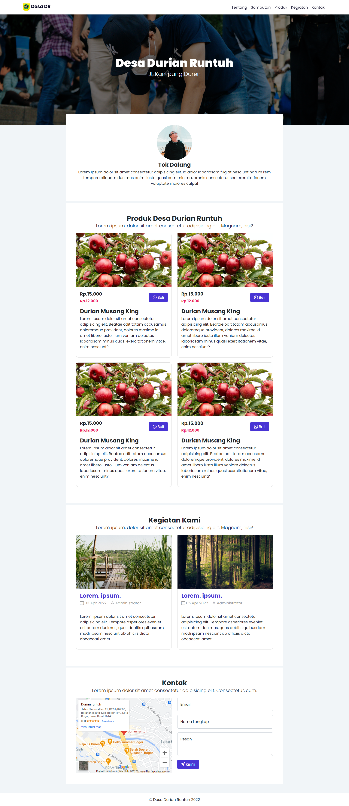

 
  

  &#xa0;

  <!-- <a href="https://landingpagedesa.netlify.app">Demo</a> -->

<h1 align="center">Landing Page Desa</h1>

  

<!-- Status -->

<!-- <h4 align="center"> 
	🚧  Landing Page Desa 🚀 Under construction...  🚧
</h4> 

 -->

  <a href="#dart-about">About</a> &#xa0; | &#xa0; 
  <a href="#sparkles-features">Features</a> &#xa0; | &#xa0;
  <a href="#rocket-technologies">Technologies</a> &#xa0; | &#xa0;
  <a href="#memo-license">License</a> &#xa0; | &#xa0;
  <a href="https://github.com/suryamsj" target="_blank">Author</a>

 

## :dart: About ##

Template website atau Landing Page untuk desa yang ingin mempunyai sebuah website.

## :sparkles: Features ##

:heavy_check_mark: Responsive\
:heavy_check_mark: Modern\
:heavy_check_mark: Mempunyai 4 section dan 3 halaman

## :rocket: Technologies ##

The following tools were used in this project:

- [HTML](https://developer.mozilla.org/en-US/docs/Glossary/Semantics)
- [SCSS](https://sass-lang.com/)
- [Bootstrap 5](https://getbootstrap.com/)
- [AOS](https://github.com/michalsnik/aos/tree/v2)

## :memo: License ##

Untuk temen-temen yang tertarik terhadap template ini, bisa cek ke halaman [Trakteer.id](https://trakteer.id/suryamsj/showcase) saya ya. Atau bisa kesini

Dibuat dengan :heart: oleh <a href="https://github.com/suryamsj" target="_blank">Muhammad Surya Jayadiprana</a>

&#xa0;
